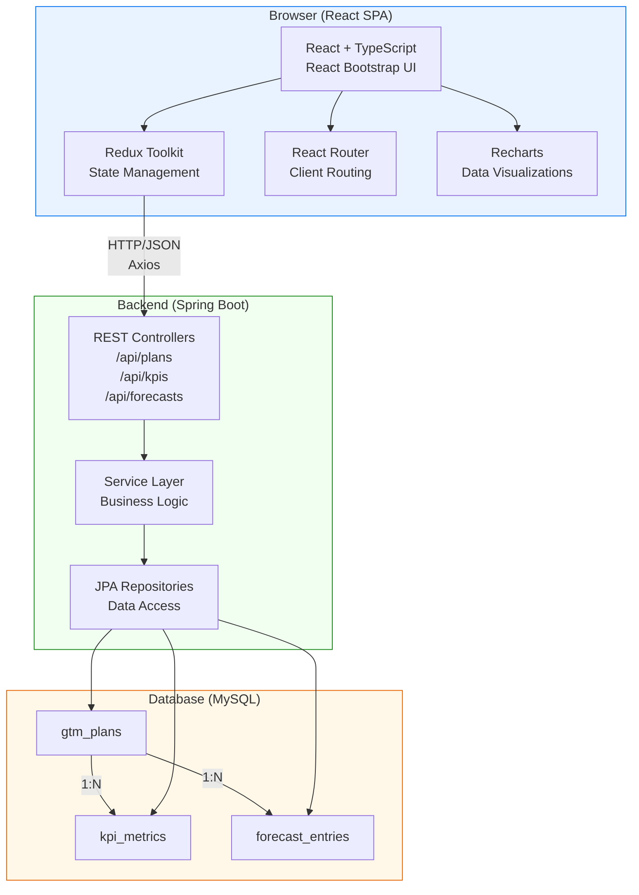
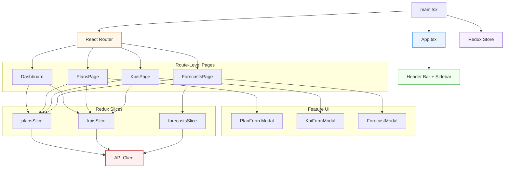
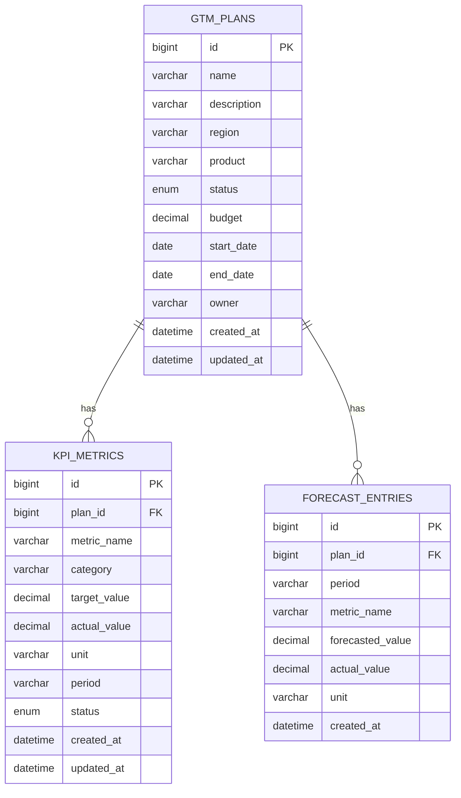

# GTM Planning Solution - Demo Application

This is a simple full-stack **Go-To-Market (GTM) Planning Solution** developed to demonstrate core functionalities and concepts. 
It mirrors real world GTM workflows by managing regional plans, tracking key performance indicators (KPIs) and validating forecast reliability.

## Business Scenario

GTM Planning team creates and tracks strategic plans across regions (EMEA, APAC, Americas...) and products (S/4HANA Cloud, BTP, SuccessFactors...). Each plan has:

- A budget and timeline
- KPI metrics (Revenue Growth, Lead Generation, Market Reach...) with target vs. actual tracking
- Forecast entries comparing projected values against actual values to measure planning reliability

This app lets a GTM team manage these plans end-to-end through an insightful dashboard, CRUD interfaces and data visualizations.

## Features

| Module | Functionality |
|---|---|
| **Dashboard** | Summary KPI tiles, budget by region bar chart, plan status pie chart, at risk KPI alerts |
| **GTM Plans** | Create/ edit/ delete plans with region, product, budget, timeline. Search and filter functionality |
| **Plan Detail** | View KPI summary with progress bars and achievement rates per plan |
| **KPI Tracker** | Add/ edit/ delete KPI metrics. Track target vs. actual and filter by plan |
| **Forecast Tracker** | Log forecast vs. actual entries. Visualize accuracy over time with a line chart |


## Architecture

You can also find the exported Architecture diagram image file inside **Architecture Documents** folder for much clearer view.



## Frontend Component Diagram

The React frontend is organized as a route driven structure. It has pages that own their own UI widgets and Redux data access.

You can also find the exported Frontend Component Diagram image file inside **Architecture Documents** folder for much clearer view.



### Data Model

You can also find the exported Data Model diagram image file inside **Architecture Documents** folder for much clearer view.



## Technology Stack

### Frontend
| Technology | Version | Purpose |
|---|---|---|
| React | 18.2.0 | Component-based UI |
| TypeScript | 5 | Type safety |
| Redux Toolkit | 2.2.1 | Global state management |
| React Bootstrap | 2.10.2 | UI component library |
| Vite | 5.1.4 | Build tool and dev server |
| Recharts | 2.12.2 | Charts and visualizations |
| Axios | 1.6.7 | HTTP client |
| React Router | 6.22.3 | Client-side routing |
| Vitest | 1.3.1 | Unit testing |

### Backend
| Technology | Version | Purpose |
|---|---|---|
| Java | 8 | Programming language |
| Spring Boot | 2.7 | Application framework |
| Spring Data JPA | 2.7 | Database Object Relational Mapping (ORM) |
| Spring Validation | 2.7 | Input validation |
| Lombok | latest | Boilerplate reduction |
| MySQL Connector | latest | Database driver |
| H2 | latest | In memory DB for tests |
| JUnit 5 | 5.10 | Unit testing |
| Mockito | 5 | Mocking framework |

### Database
- **MySQL 8+** (Used for production)
- **H2** (Used for tests. H2 is in memory, no setup needed)

## Starting the application locally

### Prerequisites

| Tool | Version |
|---|---|
| Java | 8+ |
| Maven | 3.9+ |
| Node.js | 22+ |
| MySQL | 8+ |

### 1. Database Setup

MySQL will auto create the database on first run.

If you want to create it manually:

```sql
CREATE DATABASE gtm_planning CHARACTER SET utf8mb4 COLLATE utf8mb4_unicode_ci;
```

Update database username and password credentials in `backend/src/main/resources/application.properties`:

```properties
spring.datasource.url=jdbc:mysql://localhost:3306/gtm_planning?createDatabaseIfNotExist=true
spring.datasource.username=YOUR_USERNAME
spring.datasource.password=YOUR_PASSWORD
```

### 2. Start the Backend

```bash
cd backend
./mvnw spring-boot:run
```

The API starts at **http://localhost:8080**

### 3. Start the Frontend

```bash
cd frontend
npm install
npm run dev
```

The app opens at **http://localhost:5173**

### Verify Everything Works

```bash
# Check backend health
curl http://localhost:8080/api/plans

# Should return: []
```


## API Reference

### GTM Plans - `/api/plans`

| Method | Endpoint | Description |
|---|---|---|
| GET | /api/plans | List all plans (optional `?status=ACTIVE`) |
| GET | /api/plans/{id} | Get plan by ID |
| GET | /api/plans/summary | Get aggregate statistics |
| POST | /api/plans | Create a new plan |
| PUT | /api/plans/{id} | Update a plan |
| DELETE | /api/plans/{id} | Delete a plan |

**Example - Create Plan:**
```json
POST /api/plans
{
  "name": "Germany Cloud Growth 2026",
  "description": "Expand S/4HANA Cloud in Germany",
  "region": "EMEA",
  "product": "SAP S/4HANA Cloud",
  "status": "ACTIVE",
  "budget": 500000.00,
  "startDate": "2026-06-01",
  "endDate": "2026-12-31",
  "owner": "John Doe"
}
```


### KPI Metrics - `/api/kpis`

| Method | Endpoint | Description |
|---|---|---|
| GET | /api/kpis | List all KPIs (optional `?planId=1`) |
| GET | /api/kpis/{id} | Get KPI by ID |
| POST | /api/kpis | Create a KPI metric |
| PUT | /api/kpis/{id} | Update a KPI metric |
| DELETE | /api/kpis/{id} | Delete a KPI metric |

**Example - Create KPI:**
```json
POST /api/kpis
{
  "planId": 1,
  "metricName": "Revenue Growth",
  "category": "Financial",
  "targetValue": 100000.00,
  "actualValue": 85000.00,
  "unit": "EUR",
  "period": "Q1 2026",
  "status": "AT_RISK"
}
```


### Forecast Entries - `/api/forecasts`

| Method | Endpoint | Description |
|---|---|---|
| GET | /api/forecasts | List all forecasts (optional `?planId=1`) |
| POST | /api/forecasts | Create a forecast entry |
| PUT | /api/forecasts/{id} | Update a forecast entry |
| DELETE | /api/forecasts/{id} | Delete a forecast entry |

---

## Running Tests

### Backend (JUnit 5 + Mockito)

```bash
cd backend
./mvnw test
```

Tests use H2 in memory database. No MySQL needed for tests.

Test coverage includes:
- GtmPlanServiceTest - service layer unit tests with mocked repository
- KpiMetricServiceTest - KPI service unit tests including achievement rate calculation
- GtmPlanControllerTest - controller integration tests with MockMvc


### Frontend (Vitest)

```bash
cd frontend
npm test
```

With coverage:
```bash
npm run test:coverage
```

Test coverage includes:
- plansSlice.test.ts - Redux state transitions (pending/fulfilled/rejected)
- kpisSlice.test.ts - KPI Redux slice reducer logic
- utils.test.ts - Currency formatting, status badge variant logic
- Dashboard.test.tsx - Component rendering and conditional display logic


## Design Decisions

### Why Redux Toolkit?
Redux Toolkit provides predictable global state management and aligns with professional standards. It also simplifies complex async data flows with createAsyncThunk.

### Why SAP Fiori inspired Design?
The UI follows SAP Fiori's design principles (header bar, sidebar, tables, status badges) for better user experience.

### Why DTO Pattern on the Backend?
Separating entities from DTOs protects the data model from API changes. It avoids exposing JPA internals and allows computed fields (like achievementRate and variance) to be calculated in the service layer cleanly.

### Why H2 for Tests?
Using H2 for backend tests means zero infrastructure setup and fast test execution. It also provide full isolation between test runs.
